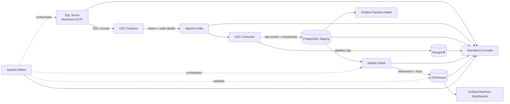

# Northwind Real-Time Data Platform

An end-to-end data engineering platform that turns operational changes in the Northwind database into replayable events, analytics-ready warehouse tables, business dashboards, and live operational telemetry.


## Why this project exists

Traditional full-refresh pipelines repeatedly move unchanged data, increase latency, and make failures difficult to diagnose. This project demonstrates a production-style alternative:

- capture inserted, updated, and deleted rows with SQL Server CDC;
- publish durable, ordered events through Kafka;
- preserve staging data and control state in PostgreSQL and operational logs in MongoDB;
- process full and incremental transformations with Apache Spark;
- serve analytical workloads from ClickHouse;
- orchestrate and validate workflows with Apache Airflow;
- visualize business KPIs and pipeline health in Grafana;
- inspect every component through a read-only Operations Console.

## Architecture



### Data flow

1. SQL Server hosts the Northwind OLTP database and exposes change tables through CDC.
2. The producer reads each capture instance from its last committed LSN and publishes changes to Kafka.
3. The consumer validates events, writes raw records to PostgreSQL, logs operational events in MongoDB, and advances offsets safely.
4. Spark reads staged data and builds a dimensional warehouse in ClickHouse.
5. Incremental jobs update only the facts and dimensions affected by new events.
6. Airflow manages dependencies, retries, checkpoints, and data-quality gates.
7. Grafana queries ClickHouse for analytics and PostgreSQL for pipeline observability.

## Technology stack

| Component | Responsibility | Local endpoint |
| --- | --- | --- |
| SQL Server 2022 | Northwind OLTP source and CDC capture | `localhost:1433` |
| Apache Kafka 4.3 | Durable event backbone and consumer offsets | `localhost:29092` |
| MongoDB 8.0 | Searchable pipeline-event history | `localhost:27017` |
| PostgreSQL 17 | Staging, raw events, checkpoints, and quality results | `localhost:5433` |
| Apache Spark | Full and incremental warehouse transformations | On-demand container |
| ClickHouse | Columnar dimensional warehouse | `localhost:8123`, `localhost:9000` |
| Apache Airflow | Workflow scheduling and recovery | <http://127.0.0.1:8080> |
| Grafana | Business intelligence and pipeline monitoring | <http://127.0.0.1:3000> |
| Operations Console | Read-only runtime diagnostics | <http://127.0.0.1:8091> |

## CDC and incremental processing

The real-time layer uses two application services:

- `cdc-producer` publishes changes to `northwind.orders.cdc` and `northwind.order_details.cdc`;
- `cdc-consumer` uses group `northwind-cdc-staging-v1`, persists events, updates control state, and routes failures to `northwind.cdc.dlq`.

The incremental Spark job reads the committed checkpoint, finds affected orders, rebuilds only the required warehouse rows, validates the write, and then advances the checkpoint. This makes retries safe and prevents partial batches from being marked complete.

## Analytical model

```text
Dimensions
├── dim_date
├── dim_geography
├── dim_customer
├── dim_employee
├── dim_supplier
├── dim_product
├── dim_shipper
└── dim_territory

Facts
├── fact_orders
└── fact_employee_territories
```

Warehouse DDL is defined in [`sql/clickhouse/01_create_warehouse.sql`](sql/clickhouse/01_create_warehouse.sql), with validation queries in [`sql/clickhouse/02_verify_full_transform.sql`](sql/clickhouse/02_verify_full_transform.sql).

## Airflow workflows

- `northwind_full_pipeline` initializes and validates the full warehouse.
- `northwind_incremental_cdc` coordinates CDC ingestion, incremental Spark processing, warehouse verification, and quality checks.

The DAG definitions are version-controlled in [`airflow/dags`](airflow/dags).

## Operations Console

The read-only Operations Console reports container health, images and ports, SQL/CDC assets, Kafka topics and consumer groups, MongoDB collections, Spark jobs, ClickHouse table statistics, Airflow control records, and Docker CPU/memory/network usage.

Start the professional edition from the repository root:

```bash
python3 server_pro.py
```

Available pages:

- Overview: <http://127.0.0.1:8091/>
- SQL Server: <http://127.0.0.1:8091/service/mssql>
- Kafka: <http://127.0.0.1:8091/service/kafka>
- MongoDB: <http://127.0.0.1:8091/service/mongodb>
- Spark: <http://127.0.0.1:8091/service/spark>
- ClickHouse: <http://127.0.0.1:8091/service/clickhouse>
- Airflow: <http://127.0.0.1:8091/service/airflow>
- Docker: <http://127.0.0.1:8091/service/docker>

The console binds to `127.0.0.1`, performs read-only queries, and refreshes every 15 seconds.

## Grafana dashboards

Six dashboards are provisioned from version-controlled JSON: Executive Overview, Sales Trends, Product Performance, Customers & Geography, Employees & Shipping, and Real-Time Pipeline Health.

### Executive Overview

High-level revenue, order, customer, product, and fulfillment indicators provide an immediate business summary.


### Sales Trends

Time-series and seasonality views explain revenue, order volume, discounts, and fulfillment performance.


### Product Performance

Product and category views expose revenue concentration, units sold, inventory value, supplier contribution, and reorder risk.


## Repository layout

```text
airflow/dags/        Airflow full and incremental workflows
docker/              Spark, ETL, Airflow, and ClickHouse configuration
etl/                 Full extraction and staging load
grafana/             Provisioning, data sources, and dashboards
kafka/               CDC producer and consumer
ops_ui/              Read-only Operations Console
scripts/             LinkedIn showcase recording utilities
spark/               Full and incremental transformations
sql/mssql/           Source restore, validation, and CDC setup
sql/postgres/        Staging, event, checkpoint, and control schemas
sql/clickhouse/      Warehouse DDL and verification queries
```

## Getting started

### 1. Configure the environment

Create `.env` and define the required credentials:

```text
MSSQL_SA_PASSWORD
POSTGRES_USER
POSTGRES_DB
POSTGRES_PASSWORD
CLICKHOUSE_DB
CLICKHOUSE_USER
CLICKHOUSE_PASSWORD
MONGO_ROOT_USERNAME
MONGO_ROOT_PASSWORD
MONGO_DATABASE
GRAFANA_ADMIN_USER
GRAFANA_ADMIN_PASSWORD
NORTHWIND_PROJECT_DIR
```

Never commit `.env`; it is ignored by Git.

### 2. Start the core databases

```bash
docker compose up -d mssql postgres-staging clickhouse
```

### 3. Run the full pipeline

```bash
docker compose --profile tools run --rm etl-runner python -m etl.full_load
docker compose --profile tools run --rm spark-runner spark-submit spark/full_transform.py
```

### 4. Start real-time CDC

```bash
docker compose -f docker-compose.yml -f docker-compose.realtime.yml \
  up -d kafka mongodb cdc-producer cdc-consumer
```

### 5. Start Airflow and Grafana

```bash
docker compose -f docker-compose.yml -f docker-compose.airflow.yml up -d airflow
docker compose -f docker-compose.yml -f docker-compose.grafana.yml up -d grafana
```

## Verification

```bash
docker compose \
  -f docker-compose.yml \
  -f docker-compose.realtime.yml \
  -f docker-compose.airflow.yml \
  -f docker-compose.grafana.yml \
  ps
```

Verify warehouse contents with [`sql/clickhouse/02_verify_full_transform.sql`](sql/clickhouse/02_verify_full_transform.sql) and inspect live component details at <http://127.0.0.1:8091/>.

## Reliability and security

- credentials are supplied through `.env` and are never committed;
- dashboards, schemas, DAGs, and transformations are version-controlled;
- services have explicit memory and CPU limits;
- database ports should remain restricted to trusted local interfaces;
- checkpoints advance only after successful processing and validation;
- failed Kafka events are routed to a dead-letter topic;
- raw events and run history remain available for audit and recovery;
- generated MP4/WebM showcase files are excluded from Git.
